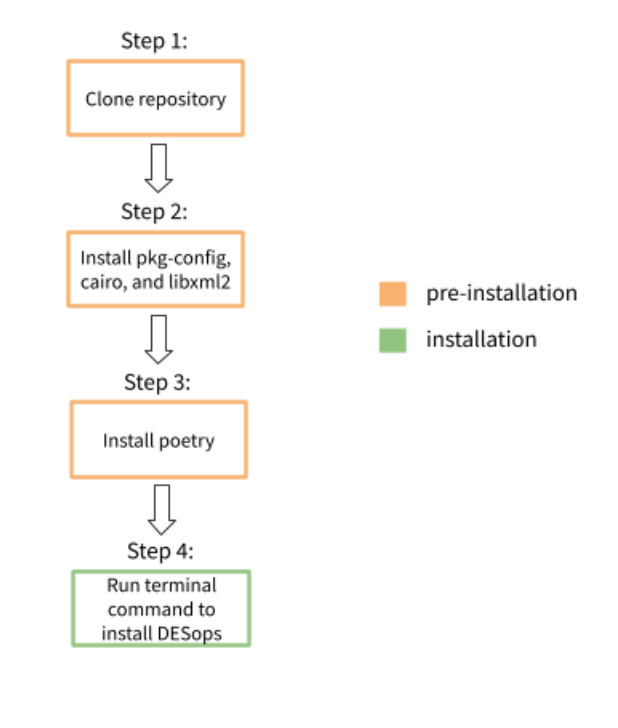

This package provides a convenient way of handling Discrete Event System models as
finite state automata. Additionally, some useful functions and operations on automata have been
implemented, including parallel/product compositions and observer computation. The goal is to provide a simple way to combine these operations in a modular environment, with the usability of Python which makes extending the functionalities provided here very straightforward.

## Installation

Below is a diagram that showcases the installation process. Before installing DESops, the first three steps must be completed first.



### Step 1: Clone Repository

On the right hand corner of this page, click on the blue box that says `Clone`. Copy and paste the HTTPS url.

In your working directory, write the following command:

    $ git clone https://gitlab.eecs.umich.edu/M-DES-tools/desops.git

After running this command, a copy of this repository will be available in your working directory.

### Step 2: Install pkg-config and cairo

These packages are dependencies required to install `pycairo`. This is key for the later installation of `python-igraph`, which DESops uses to plot graphs.

Both `pkg-config` and `cairo` can be installed at once. Depending on your operating system, you can follow the steps on this [website](https://pycairo.readthedocs.io/en/latest/getting_started.html) to properly install these dependencies.
Do **NOT** install pycairo yet. This will be done in step 4.

Windows users can skip this step if they use the pre-compiled wheel for pycairo discussed in step 4.

### Step 3: Install Poetry:

The recommended way to install poetry is writing the following commands in your terminal:

### OS X / Linux / BashOnWindows:

    $ curl -sSL https://raw.githubusercontent.com/python-poetry/poetry/master/install-poetry.py | python3 -

### Windows Powershell:

    $ (Invoke-WebRequest -Uri https://raw.githubusercontent.com/python-poetry/poetry/master/install-poetry.py -UseBasicParsing).Content | python3 -

### Alternative Method

If the method above does not work, you can use `pip` to properly install `poetry`. Run the following command:

    $ pip install --user poetry

### Common Error: Operating device does not recognize pip

Sometimes pip requires a different command depending on your operating system. If the command above did not work, try the following alternatives:

    $ python3 -m pip install --user poetry
or

    $ python -m pip install --user poetry

More information and different installation methods are available on the [poetry](https://python-poetry.org/) website if needed.

### Step 4: Install DESops:

Make sure you are in the same working directory as the `poetry.lock` file. This should be located where you cloned the repository.

DESops can be installed using [poetry](https://python-poetry.org/) and running the command:

    $ poetry install

Note that version 1.11.1 of pycairo was specified due to issues with pycairo's current version 1.20

### Note for Windows Users:

If you skipped step 2, pycairo can be installed from a pre-compiled wheel. downloaded from https://www.lfd.uci.edu/~gohlke/pythonlibs/#pycairo.
You should download the version named  `pycairo-1.21.0-cp<python-version>-cp<python-version>-<windows-version>.whl`.
For example, if your python version is 3.8 and you are on 64-bit plat form, you should install `pycairo‑1.21.0‑cp38‑cp38‑win_amd64.whl`.

Then install using `pip install <path_to>\<pycairo>.whl`.
You will then need to run `poetry install` as described above.

#### Random Automata Generation

Generating random automata using the `random_DFA` submodule requires the REGAL software package, with source code bundled in this repository.
The following is only relevant for using the `random_DFA` submodule.
(link to DESops/random_DFA/regal-1.08.0929/COPYING) Some of the files in the library have been modified, so an external installation of the software won't work.

There are detailed instructions for compiling the source code in the file `random_DFA/regal-1.08.0929/regal_readme.txt`
There are several required libraries, and a c++ compiler is needed to build the REGAL executables. The script `build.py` (only for Linux systems with a g++ compiler) automates the build process after the preqrequisite libraries are installed.

#### Opacity enforcement

Two methods for synthesizing enforcement mechanisms for opacity are currently supported. The first requires the optional
python library [EdiSyn](https://gitlab.eecs.umich.edu/M-DES-tools/EdiSyn). To install EdiSyn in an appropriate directory
, run:

    $ git clone https://gitlab.eecs.umich.edu/M-DES-tools/EdiSyn.git

Then edit `pyproject.toml` to point to this directory. You will need to uncomment this line. For development EdiSyn can be used in the editable mode.
Finally, to use this optional dependency, use the command:

    $ poetry install --extras "opacity_enf"

The second method for opacity enforcement uses the library BoSy. See (/DESops/opacity/bosy) for more details.

## Contributing to DESops

You will need [Poetry](https://python-poetry.org/) to start contribution on the DESops codes.

First, you will need to clone the repository using `git`:
```
$ git clone git@gitlab.eecs.umich.edu:M-DES-tools/desops.git
$ cd desops
```

Second, you will need to install the required dependencies and `pre-commit` git hooks:
```
$ poetry install
$ poetry run pre-commit install
```

### Before pushing your contribution to the repository

`pre-commit` checks the code style and fix it if necessary every time the code
changes are committed. When `pre-commit` fixes the code style, `git` automatically
reverts your `commit` command, so you will need to stage your changes again.

This repository employs [pytest](https://docs.pytest.org/en/latest/) to write tests.
All tests are located in `tests` directory, and must be written with the formats of
`pytest`.

You can execute tests by the following command:
```
$ poetry run pytest
```
You can also execute certain tests by specifying test names:
```
$ poetry run pytest -k [name]
```
For example, if you want to do the test defined by `def test_example():`, pass its name to `pytest` as:
```
$ poetry run pytest -k example
```

For other options of `pytest`, see `poetry run pytest --help`.

### Additional Resources

For tutorials, demonstrations, and further information about DESops, please check out the following resources:
- [Installation Tutorial](https://www.youtube.com/watch?v=xZAt-nGIQ-E)
- [DESops Tutorial 1](https://gitlab.eecs.umich.edu/M-DES-tools/desops/-/blob/master/desops_tutorial_01.ipynb)
- [DESops Tutorial 2](https://gitlab.eecs.umich.edu/M-DES-tools/desops/-/blob/master/desops_tutorial_02.ipynb)
- [Youtube Channel](https://www.youtube.com/channel/UCaoigOnm8eGMC7nslwd5-BA)
