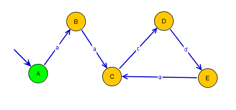

This package provides a convenient way of handling Discrete Event System models as
finite state automata. Additionally, some useful functions and operations on automata have been
implemented, including parallel/product compositions and observer computation. The goal is to provide a simple way to combine these operations in a modular environment, with the usability of Python which makes extending the functionalities provided here very straightforward.

## Installation
Currently can be installed by moving the `DESops` folder into a preexisting environment (e.g. default site-packages folder for Anaconda). There are also some dependencies required by the package:

* `igraph` must be installed. The installation process may be slightly more involved than simply using `pip`. Their [website](https://igraph.org/python/) has more information on how to install.
* `cairo` is required by `igraph` to handle plotting & visualization. Not required if not using `plot()` method.
* `math` library required for the `write_svg()` method to convert Automata into SVG files.

## Automata Class

Automata are stored as class instances (the 'Automata' class) which is largely built upon the Python library igraph, a commonly used package for handling networks. igraph's core is imlemented in C, so large networks can be stored efficiently.

There are multiple methods for interfacing automata and Automata objects, including reading/writing to `.fsm` filetypes, used in the DESUMA software package, as well as reading/writing from igraph Graphs. The igraph library has further functions to convert between Graphs and various graph filtypes (see the igraph documentation for more details).

A key feature of the igraph library is the ability to have attributes stored for individual edges and vertices. This functionality is used to track names of vertices, labels of events on transitions (edges) and probability of transitions.

## Usage

This section provides a brief overview with using the Automata class, as well as highlighting some of its useful functionalities.

The package is imported to a Python module/script or interpreter as follows:

    >>> import DESops as d

### Creating Automata

Automata can be initialized directly from `.fsm` files:

    >>> A = d.Automata('A.fsm')
    >>> B = d.Automata('B.fsm')

It's also possible to initialize from an igraph Graph:

    >>> G = igraph.Graph(directed=True)
    >>> C = d.Automata(G)

In a similar manner, Automata can be initialized from other Automata:

    >>> G = d.Automata()
    >>> G_copy = d.Automata(G)

Finally, Automata can be created from scratch within Python by individually adding edges and vertices. The Automata class has the methods `add_vertex()`, `add_vertices()`, `add_edge()`, and `add_edges()`, which call igraph Graph methods by the same. See the igraph documentation for further details on using these functions.

For example, consider constructing the following automaton:

This automaton has 5 vertices and 5 transitions, which can be added with the `add_*()` methods.

    >>> E = d.Automata()
    >>> E.add_vertices(5) # Add 5 unnamed vertices to E
    >>> E.add_edge(0, 1, 'a') # Add transition from vertex 0 to 1, with label 'a'

Continuing this pattern, we can construct a full model:

    >>> E.add_edges([(1,2),(2,3),(3,4),(4,2)], labels=['a','c','d','a'])

Vertices and Edges can be named/labelled after their creation by accessing the "name"/"label" attribute in the `VertexSeq`/`EdgeSeq` dict:

    >>> E.vs["name"] = ['A','B','C','D','E']

Note that the this process cannot be used to update individual entries. For example, the following code will NOT change the name of vertex 'E':

    >>> G.vs["name"][4] = 'F' # WILL NOT MODIFY THE VERTEX NAME

Instead, the `update_attributes()` method must be used to modify specific edge or vertex attributes. These are igraph Graph Edge and Vertex methods. For details on these methods, see the
igraph Edge and Vertex class documentations.

    >>> d = {"name" : 'F'}
    >>> G.vs[4].update_attributes(d) # Name of vertex 4 is now 'F'
    >>> G.es[0].update_attributes({"label" : 'b'}) # Change edge 0 label from 'a' to 'b'

### Operations on Automata
A and B now contain the Automata representations of 'A.fsm' and 'B.fsm'. To compute the parallel composition of A and B:

    >>> AparB = d.parallel_comp([A, B])
    >>> AprodB = d.product_comp([A, B])

The input for these compositions is a list to accomdate more than two inputs. See the `parallel_comp` documentation for more details.

    >>> ABC = d.parallel_comp([A, B, C]) # Computes A || B || C

Automata can also be visualized via the `plot()` or `write_svg()` methods, which are extensions of the igraph Graph methods by the same names. igraph uses the Cairo library for plotting. As such, Cairo is required for plotting in the Automata class.

### igraph interactions
Generally, the Automata class should have methods defined for most common uses. In some cases however, there may be desired methods which have already been implemented in the igraph Graph class. In these times where a binding is not already included in the Automata class interface, the underlying Graph instance should be accessed via the `_graph` member of Automata instances.

For example, there is no method in the Automata class for finding the degree of a network. However, igraph's Graph has a degree method, which can be used as follows:

    >>> A._graph.degree(1)

### Short note on folder structure
Usage of the DESops package revolves around the Automata class and its methods, most of which are actually implemented outside of `Automata.py`. Instead, they are separated into several folders inside the DESops package. Some operations benefit from this structure as they use other operations in their implementation, and can avoid some unnecessary computation at the expense of slightly convoluted logic. This in turn means more complicated function interfaces in the implementations, but these don't interfere with usage as the associated functions/methods in `Automata.py` have simpler interfaces.

Generally, the implementation functions operate on igraph Graphs, while interfaces in `Automata.py` use Automata instances (although they are interchangable in most situations).

## Extending functionality
It is straightforward to expand this package's functionality; for example, new functions can take advantage of the either the more user-friendly Automata-level operations or the finer control available with the igraph-level implementations. We only note some specific invariants here that should be maintained to ensure the base package continues to function as expected, as well as some interactions to keep in mind.

### Denoting initial state:
The initial state of an automaton is assumed to always be the first element in an igraph `VertexSeq`.

    >>> i = A.vs[0] # i should always be the initial state

### Datatypes of members:
* The sets of uncontrollable and unobservable events should always be `set()` instances, as well as the set of critical states (`Euc`, `Euo`, `X_crit`).

* `dead_state` should be an index of a vertice (although this might change in the future).

* `type` should generally be a string, although this is flexible. Mostly just to identify/distinguish different types of automaton, but no operations in the package make any such distinctions.

* Vertex names (`VertexSeq` attribute `"name"`) can be any object. When converting to `fsm` or plotting, the names might appear strange if this object doesn't have a simple `str()` casting.

* Edge labels (`EdgeSeq` attribute `"label`") behave similarly to vertex names.

### Other notes:
* The supremal controllable supervisor operations have specified conditions on the Automata instances used; make sure assumptions are satisfied, or use the functions that handle preprocessing.

* Serialization is neatly handled by the igraph `write_pickle()` and `read_pickle()` methods. See the igraph documentation for more details, but they can be used as Automata methods with no issues.
